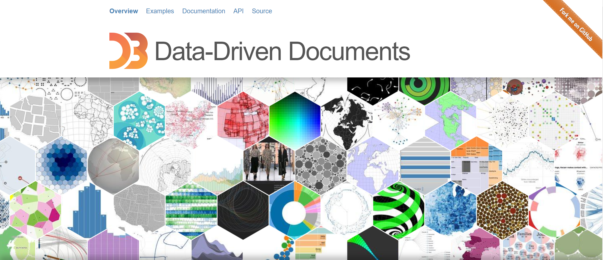

# A simple Learning Task
Introduce a simple case to help beginners learn d3.js.
## D3.js
https://d3js.org/   
https://observablehq.com/


## How to run
```
cd d3-traing-task
python -m http.server 8000
```
## Result

